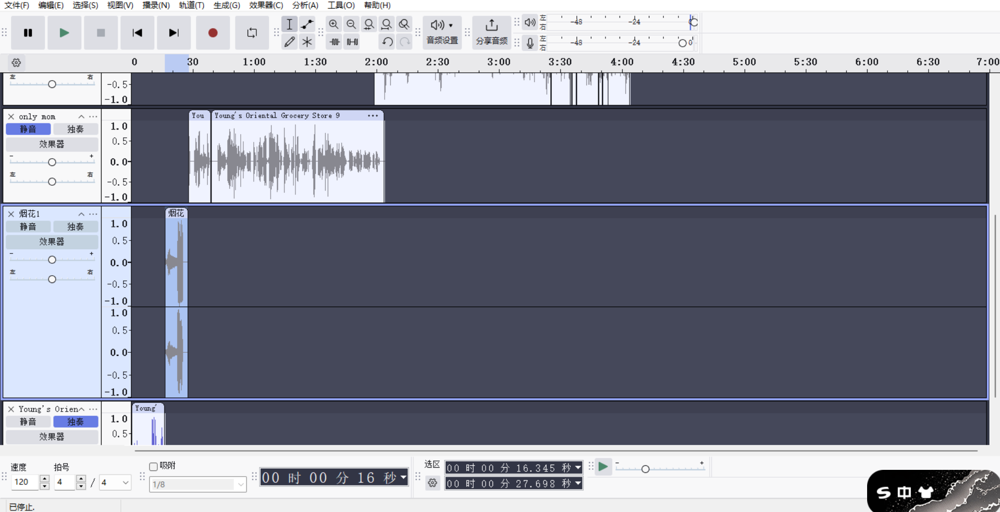
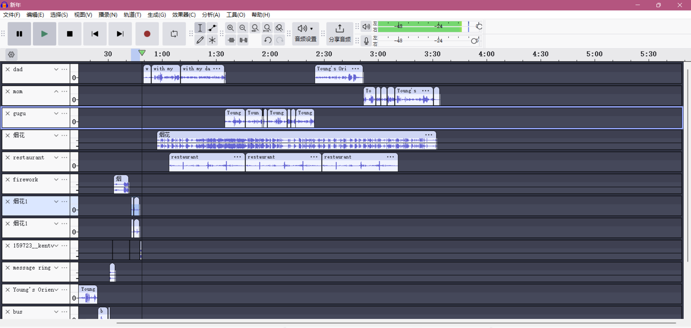
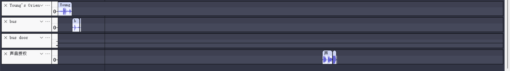

This is the future site of So-and-So's audio narrative.   
# Spring Festival At Pittsburgh
The Spring Festival, also known as Chinese New Year (CNY), is the most important and widely celebrated traditional festival in China. It marks the beginning of the lunar new year and is a time for family reunions, festive celebrations, and cultural traditions that have been passed down for generations. It is one of the most important festival in China when family go back to visit relatives and friends greeting each other, having New Year Eve reunion Dinner together, watching Spring Festival Gala, setting off fireworks and firecrackers to celebrate the festival, having dinner together and wait for the new year to come. It is like the Christmas here.  
This audio sound is a record of I going back home from the bus at the Spring Festival day which is include a record sound of taking bus, walking back home and opening the door with my keys, walking in to my room laying on the bed, receiving messages from my family which is videos for the fireworks that they set. And then, I decided to make a phone call to my parents, where you would hear a sound of phone ring and my parents pick up. We expressed our greetings, care, and New Year's wishes to each other. My family call includes my mother, my dad and my aunt. By the end of the sound is their permission for me to use their voice.  
**Setting:** outside of home, bus stop, home  
| needs  | Solution | source | lisence | 
| ------------- | ------------- | ------------- | ------------- |
| walking  | record myself  |  |  |
| bus door | "Bus door 2.wav" by chimerical | https://freesound.org/s/104276/ | Attribution NonCommercial 4.0 |
| opendoor  | record myself  |  |  |
| message ringtone | Message Ringtone by SergeQuadrado | https://freesound.org/s/567207/ | Attribution NonCommercial 3.0 |
| button sound | "iPad button sound effect.mp3" by KentVideoProduction is marked with CC0 1.0. | https://freesound.org/s/159723/ | Creative Commons 0 |
| Newyear firework with cheers | “New Year's Fireworks Crowd" by OroborosNZ| https://freesound.org/s/141253/ | Creative Commons 0 |
| sound of firework| record myself  |  |  |
| phone ring  | record myself on the pavement |  |  |
| sound at restaurant |" ambiant sound of breakfast in a calm restaurant 2 /son d'ambiance petit dejeuner restau calme 2" by cecgwen| https://freesound.org/s/738914/ | Attribution 4.0 |
| phone call with my parents (separate in parts) | record myself at home with the permission adding at the end of the sound|  |  |
| Ye Liang's voice | with record permission |  |  |
| Yang Jun's voice | with record permission |  |  |
| Ye Ling's voice | with record permission |  |  |

  
**Asset List:**   
phone call by Ye Liang, Yang Jun, Ye Ling with the voice permisson in the end of the sound  
iPad button sound effect.mp3 by KentVideoProduction -- https://freesound.org/s/159723/ -- License: Creative Commons 0 - public domain  
New Year's Fireworks Crowd by OroborosNZ -- https://freesound.org/s/141253/ -- License: Creative Commons 0 - public domain  
ambiant sound of breakfast in a calm restaurant 2 /son d'ambiance petit dejeuner restau calme 2 by cecgwen -- https://freesound.org/s/738914/ -- License: Attribution 4.0 - public domain  
Bus door 2.wav by chimerical -- https://freesound.org/s/104276/ -- License: Attribution NonCommercial 4.0 - public domain  
Message Ringtone by SergeQuadrado -- https://freesound.org/s/567207/ -- License: Attribution NonCommercial 3.0 - public domain  
  
**Screenshot:**  
1/28    
    
2/2    
    
2/10  
    
  

